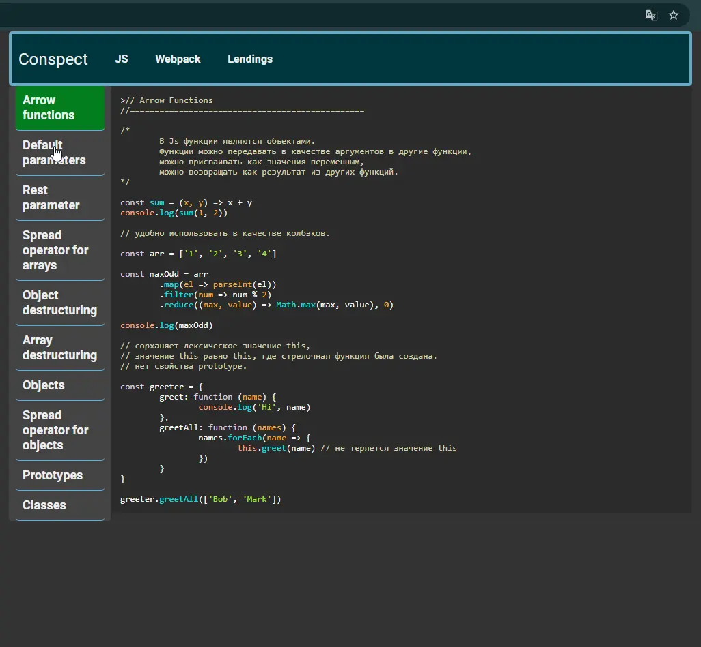

# Js-conspect (web-page)

### Video preview:

### Website:
https://js-conspect.netlify.app

### Description:
A summary on the topic of javascript and webpack, with code examples and diagrams.

### Resources used:
- https://app.netlify.com/
